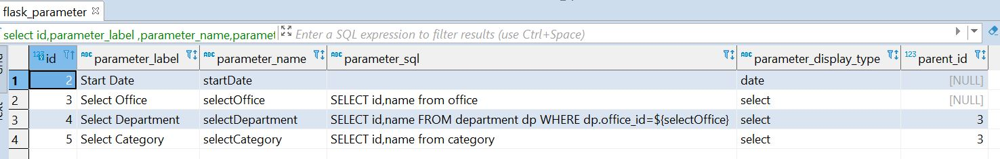

# flask_report_system
provides system to design report by writing on SQL on app itself

[Complete blog about this report system ](https://ramramesh1374.medium.com/report-system-in-flask-4bf895091e5e "Flask Report System")

1.Install requiremnets from requiremnets.txt

Features:
1. Add reports dynamically from UI
2. Add Filter like dropdown,date,text dynamically.
3. Everything configured in Database so it will be moduler.
4. Dependent dropdown also available dynamically.


Workflow gif


Parameter(filters can be configured in db like following)


```python
    pip install -r  requirements.txt 
    python manage.py init db 
```

if you dont see any examples in database:
run the script to load examples

```python
 python load_examples.py
```

To Run the server:
```python
   python manage.py runserver
```

## Contributing
Pull requests are welcome. For major changes, please open an issue first to discuss what you would like to change.


