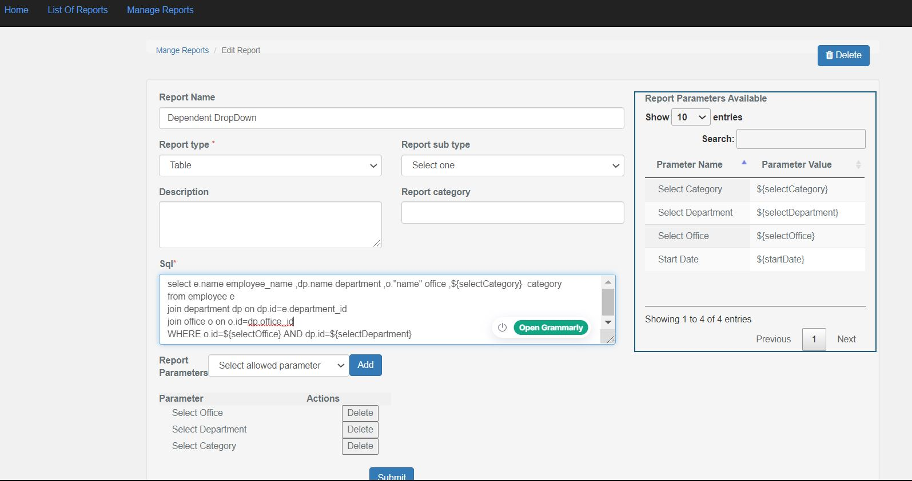

# flask_report_system
provides system to design report by writing on SQL on app itself

1.Install requiremnets from requiremnets.txt

Features:
1. Add reports dynamically from UI
2. Add Filter like dropdown,date,text dynamically.
3. Everything configured in Database so it will be moduler.
4. Dependent dropdown also available dynamically

Parameter(filters can be configured in db like following)

